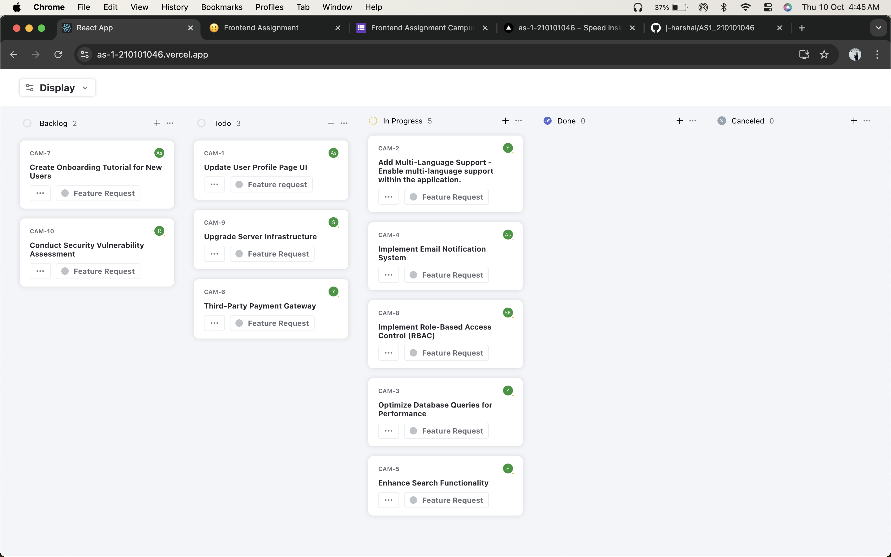
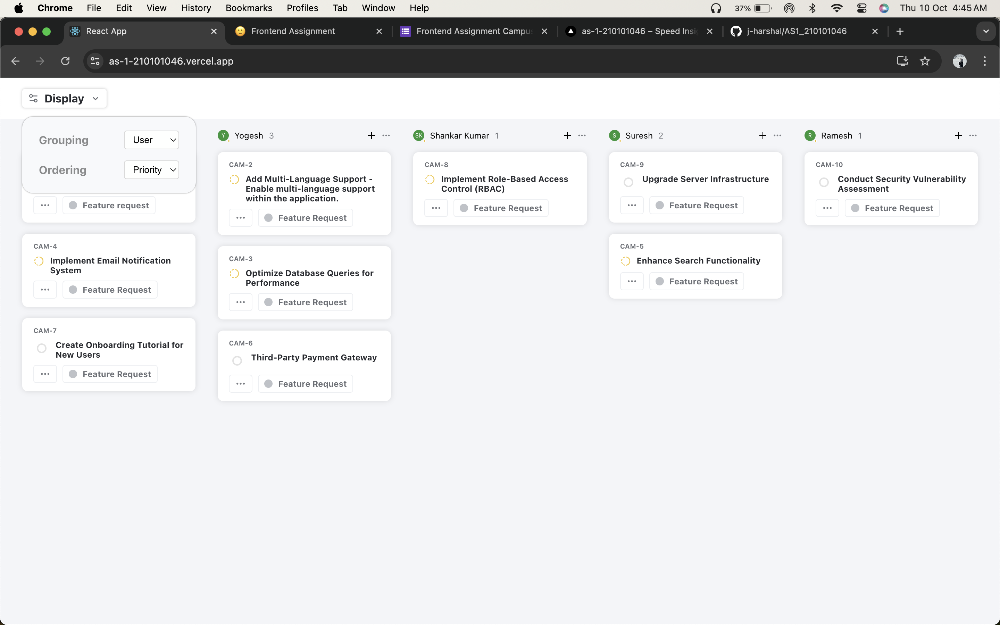
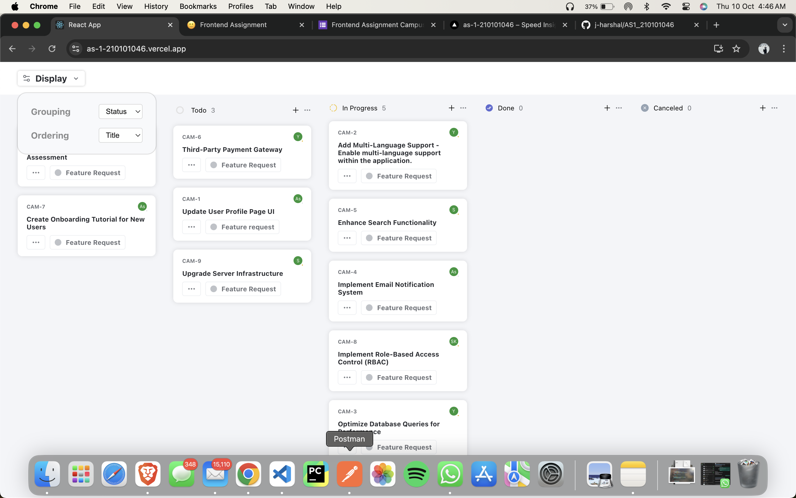
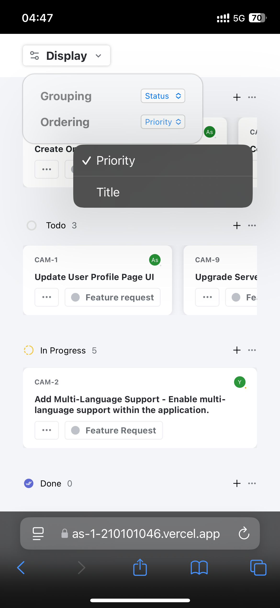
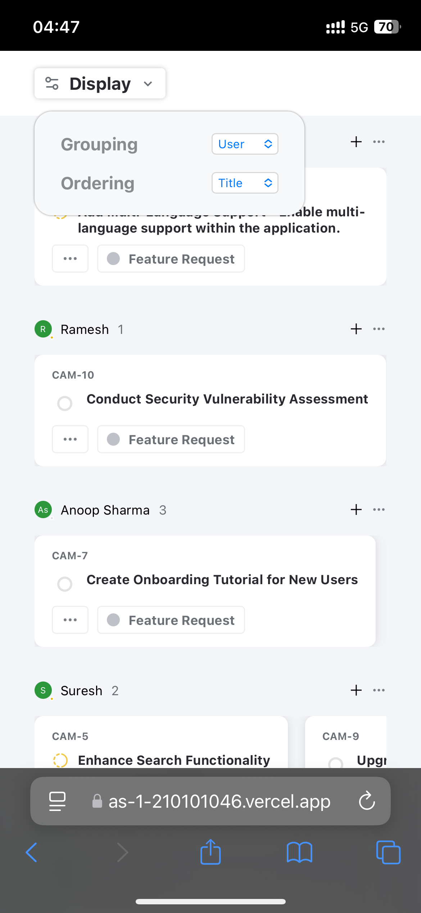
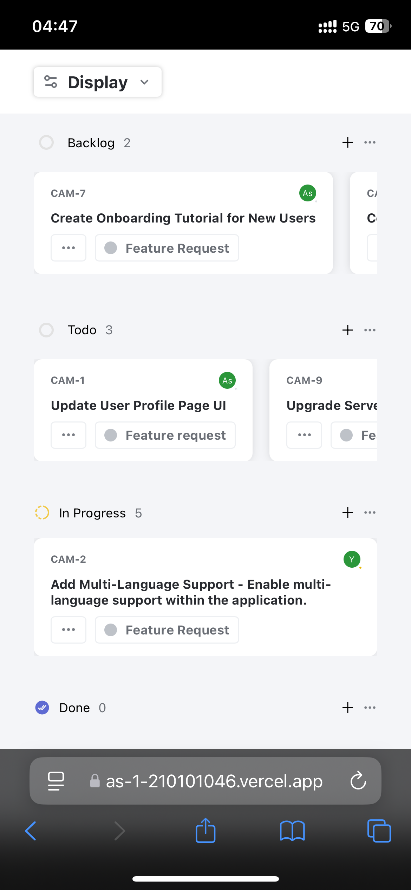

# FrontEnd Assignment

## Hosted Link

You can view the live version of the application at: [https://as-1-210101046.vercel.app/](https://as-1-210101046.vercel.app/)

## Screenshots

Here are some screenshots of the application:







## Getting Started
Follow these given steps:

### Prerequisites

Make sure you have the following installed:

- Node.js
- Yarn  (yarn install)

### Installation

1. Clone the repository:

   ```bash
   git clone https://github.com/j-harshal/AS1_210101046
   cd AS1_210101046
